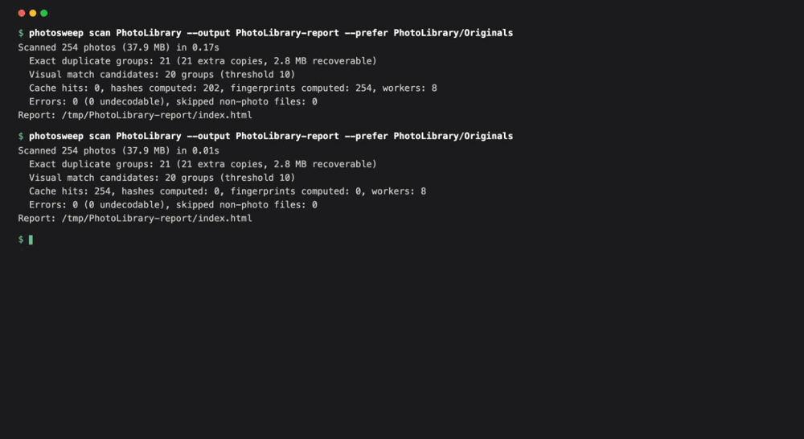

# PhotoSweep

[](https://github.com/Digital-Ibraheem/photosweep/actions/workflows/ci.yml)

A local Swift command-line tool for macOS. It finds **exact duplicate** and **visually similar**
photos in a folder, writes a visual **HTML review report**, and moves the copies you choose into a
**quarantine** folder. Every move can be undone.



```sh
# Scan a folder and create an HTML report
photosweep scan ~/Pictures/Exports --output ./report

# Scan again: unchanged files come from the cache
photosweep scan ~/Pictures/Exports --output ./report

# Apply the selections exported from the report
photosweep quarantine ~/Downloads/selections.json

# Put the files back
photosweep undo <operation-id>
```

- **Fast repeat scans.** SHA-256 hashes and visual fingerprints are cached per file and reused while
  size, modification time and inode are unchanged. `--verify` recomputes everything.
- **Bounded memory.** A fixed number of workers, 1 MiB hashing chunks, and ImageIO thumbnail
  decoding mean memory doesn't depend on photo size.
- **Safe cleanup.** Quarantine re-hashes each selected file before moving it. It always keeps one
  verified copy per group and never overwrites anything. A journal makes interrupted operations
  recoverable.

## Requirements

macOS 13 or later and Swift 6 (Xcode 16 or the Command Line Tools). Supports JPEG, PNG and HEIC/HEIF
in ordinary folders. It doesn't read the Apple Photos library: export or copy photos to a folder first.

## Build and run

```sh
git clone https://github.com/Digital-Ibraheem/photosweep.git
cd photosweep
swift build -c release
cp .build/release/photosweep /usr/local/bin/   # optional

# Try it on the bundled fixtures
swift run -c release photosweep-dev make-fixtures            # writes Fixtures/generated
swift run -c release photosweep scan Fixtures/generated --output ./report --prefer Fixtures/generated/Originals
open report/index.html
```

Run the tests with `./scripts/test.sh`. It is the same as `swift test`, plus the flags needed to find
Swift Testing when only the Command Line Tools are installed.

## Using it

### 1. Scan

```
photosweep scan <folder> [--output ./photosweep-report] [--prefer <folder> ...]
                [--workers N] [--threshold 10] [--exact-only] [--verify]
                [--cache <file> | --no-cache]
```

- `--prefer` names folders whose copies should be suggested as the one to keep (repeatable, in
  priority order).
- `--threshold` sets the maximum differing bits (out of 64) between a similar photo and its group's
  reference image. The default of 10 comes from the [evaluation](docs/evaluation.md).
- Ctrl-C stops gracefully and saves completed work; the next scan picks up from there.

The report folder contains `index.html`, `thumbs/` and `scan.json` (the record that cleanup checks
against). The page is fully self-contained: no server, no network.

### 2. Review

The report shows a summary, then **Exact duplicates** (byte-identical) and **Visually similar**
(look alike but differ) as separate sections. Each group shows large thumbnails, dimensions, sizes
and paths, and marks a suggested **Keep** with its reason. Tick the copies you don't want, then
click **Export selections**. The page refuses to export if a group would have every copy selected.
Similar photos are never pre-selected.

### 3. Quarantine

```
photosweep quarantine selections.json [--dry-run] [--yes] [--manifest report/scan.json]
```

PhotoSweep checks every selected file:

- it belongs to the recorded scan
- it is inside the scanned folder
- it has the same size and SHA-256 as when scanned
- its group keeps at least one unchanged, unselected copy

It then prints the plan and asks for confirmation. Files are moved to
`<folder>/.photosweep-quarantine/<operation-id>/`, keeping their relative paths. Later scans
ignore that folder. Delete it yourself once you're satisfied.

### 4. Undo

```
photosweep undo <operation-id>
photosweep operations          # list operations and their status
```

Undo restores every file it can. If something new now exists at an original path, that file stays in
quarantine and is reported; it is never overwritten.

## How it works

See [docs/DESIGN.md](docs/DESIGN.md) for cache invalidation, matching limitations, and cleanup
recovery. In short:

1. Discover files and record size, mtime and inode. Hard links are recognized and processed once.
2. Hash only files whose byte size matches another file's.
3. Compute a 64-bit **dHash** on an orientation-corrected thumbnail.
4. Group exact duplicates by hash. Then group similar images around a **representative**: every
   member must match the representative, so chains (A~B, B~C) aren't merged. A BK-tree index narrows
   the search and is tested against a linear scan.

## Evidence

- **Matching quality:** [docs/evaluation.md](docs/evaluation.md). Precision and recall per threshold
  on a labeled set built from 32 CC0 photos: resized, recompressed, converted, color-edited,
  rotated and cropped variants, plus different photos of the same subject.
- **Performance:** [docs/benchmarks.md](docs/benchmarks.md). Cold vs. repeat scans, incremental
  change, worker scaling and peak memory, with machine and method. Reproduce with
  `scripts/benchmark.sh`.
- **Tests:** `Tests/PhotoSweepCoreTests` cover the completion checks from each milestone, for example:
  - a corrupt duplicate is found without decoding
  - a second scan decodes nothing
  - an interrupted scan resumes
  - changed files are rejected
  - an interrupted quarantine is reconciled
  - undo never overwrites

## Project layout

```
Sources/PhotoSweepCore      library: discovery, hashing, fingerprints, cache, matching, report, cleanup
Sources/PhotoSweepCLI       the photosweep command
Sources/PhotoSweepFixtures  fixture generation, evaluation, benchmark data (dev only)
Sources/PhotoSweepDev       the photosweep-dev command
Tests/PhotoSweepCoreTests   Swift Testing suites
Fixtures/sources            32 CC0 photos (Wikimedia Commons) + credits
docs/                       design note, evaluation, benchmarks, demo
scripts/                    test and benchmark scripts
```

## Limitations

- dHash misses crops and true rotations, and it treats very different edits of one photo as
  different photos. Visual groups are suggestions to review, not verdicts.
- The cache trusts size, mtime and inode. Use `--verify` if a tool may have rewritten files while
  preserving timestamps. Cleanup itself always re-hashes.
- Quarantine works within one volume; it does not copy across disks.
- RAW files, videos, Live Photo pairs and the Photos library are out of scope for this version.

## License

Code: MIT. Fixture photos: CC0 (see [Fixtures/CREDITS.md](Fixtures/CREDITS.md)).
